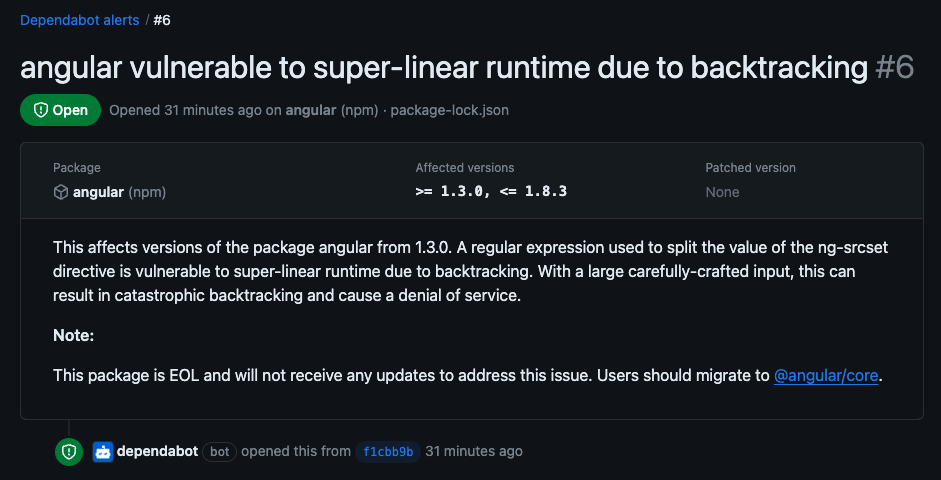

# Kort innføring til Dependabot

Dependabot er et innebygd sikkerhetsverktøy i GitHub som scanner tredjepartsbilbioteker som brukes i prosjekter. Den har flere funklsjonaliteter, men her vil vi fokusere på varsling av sårbarheter. Vi vil ikke gå inn på hvordan verktøyet fungerer, men hvordan det kan brukes under utvikling.

## Beskrivelse av bruk

I repo-oversikten ser vi `Security` fanen. Denne har et tall bak seg som er antallet på sårbarheter funnet.

Inne på fanen vil man se samme tall ved Dependabot seksjonen. Når denne er valgt får man en oversikt over sårbarhetene med litt tilleggsinfo, (påvirket pakke, alvorlihetsgrad, når sårabrheten ble oppdaget).

Trykker man seg videre inn på en av sårbarhetene vil man mer info om sårbarheten og hvilke versjoner som er påvirket og vanligvis hvilken versjon har en patch for sårbarheten. Dette eksemplet bruker en pakke som ikke lenger er vedlikeholdt, men dette vil gjerne stå under `patchetd version`.

Herfra kan utvikler undersøke om prosjektet er ekponert til denne sårbarheten eller ikke, og handle utifra det.

Ved interesse kan GitHubs egen dokumentasjon om Dependabot finnes her: https://docs.github.com/en/code-security/dependabot/dependabot-alerts/about-dependabot-alerts
